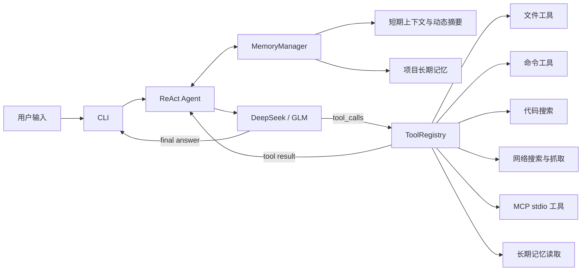

# ICoder

ICoder 是一个使用 Python 实现的命令行 ReAct 编程智能体。目前已具备：

- 连续对话和 ReAct 工具调用循环
- 短期记忆、Token 累计和上下文自动压缩
- 按项目隔离的 Markdown 长期记忆、显式保存和后台自动提取
- DeepSeek、智谱 GLM OpenAI-compatible 客户端
- 推理、正文和工具状态流式输出
- 运行时模型切换
- 工作区内文件读写、命令执行和代码搜索
- 网络搜索（GLM / SerpAPI）与网页抓取
- 用户级本地 stdio MCP Server 接入与状态查看
- Google Chrome DevTools MCP 工具发现与调用
- 可安装的 `icoder` 命令行入口
- 无需 API Key、无需联网的自动化测试

## 快速开始

### 1. 环境要求

- Python 3.11+
- DeepSeek 或智谱 GLM API Key 至少一个

### 2. 创建虚拟环境并安装

Windows PowerShell：

```powershell
python -m venv venv
venv\Scripts\Activate.ps1
python -m pip install -e ".[dev]"
```

macOS/Linux：

```bash
python3 -m venv venv
source venv/bin/activate
python -m pip install -e ".[dev]"
```

### 3. 配置模型

复制示例配置：

```powershell
Copy-Item .env.example .env
```

或在 macOS/Linux 中执行：

```bash
cp .env.example .env
```

按需填写 `.env`：

```dotenv
ICODER_PROVIDER=deepseek

DEEPSEEK_API_KEY=your-deepseek-api-key
DEEPSEEK_BASE_URL=https://api.deepseek.com
DEEPSEEK_MODEL=deepseek-v4-flash

GLM_API_KEY=your-glm-api-key
GLM_BASE_URL=https://open.bigmodel.cn/api/coding/paas/v4
GLM_MODEL=glm-5.1

# 可选；未配置时使用用户目录下的 .icoder/memory
# Windows 示例：C:\Users\your-name\.icoder\memory
# 也可以设置为项目附近的目录，例如 C:\data\icoder-memory
ICODER_MEMORY_ROOT=

# Web 搜索默认使用 GLM（复用 GLM_API_KEY），也可切换为 SerpAPI
# WEB_SEARCH_PROVIDER=glm
# SERPAPI_API_KEY=
```

模型名称由服务商账号实际可用模型决定。如果默认模型不可用，修改对应的 `*_MODEL`，或启动时通过 `--model` 覆盖。

### 4. 启动

```powershell
icoder --provider deepseek --workspace .
```

也可以使用模块入口：

```powershell
python -m icoder --provider glm --model glm-5.1 --max-steps 12 --workspace .
```

查看全部启动参数：

```powershell
icoder --help
icoder --version
```

## 启动参数

| 参数 | 说明 | 默认值 |
|---|---|---|
| `--provider` | `deepseek` 或 `glm` | `ICODER_PROVIDER`，未配置时为 `deepseek` |
| `--model` | 覆盖当前 Provider 的模型 | 对应的 `*_MODEL` |
| `--workspace` | 本地工具可以访问的工作区 | 当前目录 |
| `--max-steps` | 单次任务最大 ReAct 迭代次数 | `12` |
| `--version` | 显示版本 | - |

## 交互命令

| 命令 | 说明 |
|---|---|
| `/model` | 显示当前 Provider 和模型 |
| `/model deepseek` | 切换到 DeepSeek，并读取 DeepSeek 环境配置 |
| `/model glm` | 切换到 GLM，并读取 GLM 环境配置 |
| `/model glm:glm-5.1` | 切换 Provider 并临时指定模型 |
| `/clear` | 清空当前对话历史，保留 system prompt |
| `/compact` | 压缩较早对话，保留最近 3 轮完整对话 |
| `/save 内容` | 提取内容并保存为当前项目的长期记忆 |
| `/mcp` | 显示已配置 MCP Server 的连接状态、工具数量或失败原因 |
| `/help` | 显示交互命令帮助 |
| `/exit`、`/quit` | 退出程序 |

未知斜杠命令不会发送给模型。模型切换成功后保留已有上下文；如果新 Provider 未配置或创建失败，继续使用原客户端。Ctrl+C 取消当前输入或任务，Ctrl+D 正常退出。

## MCP 与 Chrome DevTools

ICoder 可从用户级 `~/.icoder/mcp.json` 启动本地 stdio MCP Server。需要 Python MCP SDK、Node.js LTS、npm，以及使用 Chrome DevTools MCP 时所需的当前稳定版 Google Chrome。

推荐的 Chrome DevTools MCP 配置如下。`--isolated` 会让服务使用并在关闭时清理临时 Chrome profile；`--no-usage-statistics` 和 `--no-performance-crux` 分别关闭官方服务的使用统计和性能 URL 的 CrUX 查询。

```json
{
	"mcpServers": {
		"chrome-devtools": {
			"command": "npx",
			"args": [
				"-y",
				"chrome-devtools-mcp@latest",
				"--isolated",
				"--no-usage-statistics",
				"--no-performance-crux"
			],
			"startupTimeoutSeconds": 60,
			"toolTimeoutSeconds": 120
		}
	}
}
```

成功连接后，服务工具以 `mcp__chrome_devtools__...` 形式提供给模型。配置或单个服务启动失败时，ICoder 会显示警告并继续提供内置工具。使用 `/mcp` 可查看每个已配置 Server 的连接状态、已发现工具数量和失败原因。首版支持文本和结构化 MCP 结果；截图、音频和二进制结果不会进入模型上下文，应优先使用 `take_snapshot`。

Chrome DevTools MCP 能检查、调试和修改其连接的浏览器内容。不要把它连接到含有敏感页面或日常登录数据的 Chrome profile；如需连接现有 Chrome，需自行配置官方的 `--autoConnect` 或 `--browser-url` 参数并了解相应风险。

## 工作原理



Agent 会维护 OpenAI-compatible 消息历史：

1. 追加用户消息并调用当前 `LlmClient`。
2. 模型返回工具调用时，保存完整 assistant `tool_calls`。
3. 按原始顺序执行工具，并使用对应的 `tool_call_id` 回灌结果。
4. 工具失败时将 `ERROR:` 结果回灌，让模型有机会修正参数。
5. 模型不再调用工具时，将文本作为最终回答返回。

每次调用模型前，Agent 都会检查短期记忆的 Token 用量。模型交互使用服务端返回的 usage 累计，当前用户输入按中文约 1.5 字/token、其他文本约 4 字符/token 估算。当用量达到上下文窗口的 90% 时，Agent 会把较早对话压缩成动态摘要并加入 system prompt，同时完整保留最近 3 轮对话以及正在执行的工具调用链。DeepSeek 上下文窗口按 1M Token 管理，GLM 按 200K Token 管理；也可以使用 `/compact` 手动触发压缩。

### 记忆系统

`MemoryManager` 是 Agent 使用的统一记忆门面，负责短期上下文、Token 预算、压缩、长期存储和记忆提取。

#### 短期记忆

短期记忆始终以 OpenAI-compatible 消息数组发送给模型。压缩前的结构为：

```text
system 基础提示词 + 长期记忆索引
user / assistant / tool 历史消息
user 当前问题
```

压缩后的结构为：

```text
system 基础提示词 + 长期记忆索引 + 动态对话摘要
最近 3 轮完整 user / assistant / tool 消息
当前未完成轮次（如有）
```

一轮对话从 user 消息开始，到不含 `tool_calls` 的最终 assistant 消息结束。压缩以完整轮次为单位，不会拆开 assistant 工具调用与对应的 tool 结果。`/clear` 会清除短期历史、动态摘要、Token 计数和待提取事件，但不会删除长期记忆。

#### 长期记忆目录

长期记忆保存在 `ICODER_MEMORY_ROOT` 下。未配置时默认使用用户目录下的 `.icoder/memory`。系统对规范化后的工作区绝对路径计算 SHA-256，不同工作区使用不同项目目录：

```text
<ICODER_MEMORY_ROOT>/
└── <workspace-sha256>/
	├── MEMORY.md
	├── [user]回复偏好.md
	├── [project]测试命令.md
	├── [correction]生成目录修改规则.md
	└── [resource]接口文档.md
```

四种记忆类型：

| 类型 | 内容 |
|---|---|
| `user` | 用户的稳定偏好、习惯和长期要求 |
| `project` | 项目架构、命令、约定和稳定事实 |
| `correction` | 用户对错误操作或不符合要求行为的纠正 |
| `resource` | 外部文档、接口和资源信息 |

单条记忆使用 Markdown 和 YAML Front Matter：

```markdown
---
type: project
name: "测试命令"
description: "项目使用 pytest 运行自动化测试"
---

## Content

运行完整测试时使用 python -m pytest -q。
```

`MEMORY.md` 每行保存一个文件名和简要描述：

```text
[project]测试命令.md: 项目使用 pytest 运行自动化测试
[user]回复偏好.md: 用户偏好简洁的中文回复
```

启动时最多读取索引前 200 行并加入 system prompt，不会预先加载所有记忆正文。模型需要详情时调用 `read_memory`，且只能使用当前项目已加载索引中的准确文件名。记忆正文和索引使用临时文件替换方式写入；相同类型、相同名称的记忆会更新原文件和索引行。

#### 记忆写入

显式写入：

```text
/save 用户偏好简洁的中文回答
```

该命令同步调用当前模型，将内容提取为最多 3 条结构化记忆，保存成功后立即刷新当前会话 system prompt 中的索引。

隐式写入会统计 user 消息、assistant 消息和每条 tool 结果。累计达到 4 个事件后，在一轮对话最终回答完成时启动守护线程，并使用同 Provider、同模型的独立客户端提取记忆。后台处理不会阻塞最终回答；无有价值内容或提取失败时不会写入文件。后台新增的索引会写入磁盘并可由 `read_memory` 读取，完整索引会在下一次启动时注入 system prompt。

提取提示明确禁止保存 API Key、密码、Token、Cookie、私钥等秘密，也不会保存闲聊、一次性任务或未经确认的推测。

默认最多执行 12 步；连续重复相同工具调用 3 次、超过步骤预算或返回空答案时抛出 `AgentLoopError`，避免无限循环。DeepSeek 返回的 `reasoning_content` 会按其工具调用协议带入下一轮请求，其他 Provider 默认不回传该字段。

## 内置工具

`create_default_registry(workspace)` 注册以下工具：

| 工具 | 能力 | 主要限制 |
|---|---|---|
| `read_file` | 按行读取 UTF-8 文本 | 最多 2000 行，结果有字符预算 |
| `write_file` | 写入文本并自动创建父目录 | 单次最多 5MB |
| `list_dir` | 列出目录内容 | 最多 200 项 |
| `execute_command` | 在工作区执行系统 Shell 命令 | 默认 60 秒超时，输出最多 8000 字符 |
| `search_code` | 字面量或正则搜索代码 | 跳过依赖目录、二进制和超大文件 |
| `web_search` | 搜索公开网页，返回标题、URL 和摘要 | 默认 5 条，最多 10 条；需配置 API Key |
| `web_fetch` | 抓取 HTTP(S) 页面并提取正文为 Markdown | 超时 20s，最大 5MB；仅支持静态 HTML |
| `read_memory` | 读取当前项目的一条长期记忆 | 只能读取启动索引中存在的准确文件名 |

文件和搜索工具拒绝绝对路径、`..` 父目录跳转以及符号链接逃逸。代码搜索默认忽略 `.git`、`venv`、`.venv`、`node_modules`、`dist`、`build` 和缓存目录。

> `execute_command` 的破坏性命令规则只是基础防护，不是容器、虚拟机或操作系统沙箱。请只把 `--workspace` 指向可信目录，并在执行涉及修改或删除的任务前自行确认风险。

## 项目结构

```text
src/icoder/
├── agent/          # ReAct 循环、会话历史和循环保护
├── cli/            # argparse 入口、交互循环和命令解析
├── llm/            # LlmClient、OpenAI-compatible 模板、DeepSeek/GLM、工厂
├── memory/         # 短期上下文、压缩、长期存储和记忆提取
├── mcp/            # 用户级 stdio MCP 配置、运行时与工具桥接
├── tools/          # 工具协议、注册表、文件/命令/搜索/网络工具
├── web/            # 网络搜索策略（GLM/SerpAPI）与网页抓取（httpx + trafilatura）
├── __init__.py
└── __main__.py

tests/
├── unit/           # Agent、CLI、LLM、记忆和工具单元测试
└── integration/    # ReAct 和 CLI 完整链路测试
```

## 开发与测试

运行完整测试：

```powershell
python -m pytest -q
```

自动化测试使用 Fake LLM 和模拟 OpenAI SDK，不访问真实模型服务，也不需要 API Key。

其他验证命令：

```powershell
python -m compileall -q src tests
python -m pip check
python -m pip wheel . --no-deps
```

集成测试覆盖以下完整路径：

```text
CLI → Agent → MemoryManager → Fake LLM → ToolRegistry → tool result → 最终回答
```

真实 Provider 调用属于手工冒烟测试，需要自行配置 API Key，调用可能产生费用。
