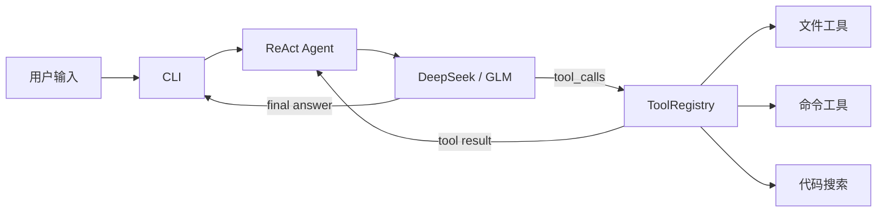

# ICoder

ICoder 是一个使用 Python 实现的最小命令行 ReAct 编程智能体，参考 PaiCLI 的分层思想构建。目前 MVP 已具备：

- 连续对话和 ReAct 工具调用循环
- DeepSeek、智谱 GLM OpenAI-compatible 客户端
- 运行时模型切换
- 工作区内文件读写、命令执行和代码搜索
- 可安装的 `icoder` 命令行入口
- 无需 API Key、无需联网的自动化测试

## 快速开始

### 1. 环境要求

- Python 3.11+
- DeepSeek 或智谱 GLM API Key 至少一个

### 2. 创建虚拟环境并安装

Windows PowerShell：

```powershell
python -m venv venv
venv\Scripts\Activate.ps1
python -m pip install -e ".[dev]"
```

macOS/Linux：

```bash
python3 -m venv venv
source venv/bin/activate
python -m pip install -e ".[dev]"
```

### 3. 配置模型

复制示例配置：

```powershell
Copy-Item .env.example .env
```

或在 macOS/Linux 中执行：

```bash
cp .env.example .env
```

按需填写 `.env`：

```dotenv
ICODER_PROVIDER=deepseek

DEEPSEEK_API_KEY=your-deepseek-api-key
DEEPSEEK_BASE_URL=https://api.deepseek.com
DEEPSEEK_MODEL=deepseek-v4-flash

GLM_API_KEY=your-glm-api-key
GLM_BASE_URL=https://open.bigmodel.cn/api/coding/paas/v4
GLM_MODEL=glm-5.1
```

模型名称由服务商账号实际可用模型决定。如果默认模型不可用，修改对应的 `*_MODEL`，或启动时通过 `--model` 覆盖。

### 4. 启动

```powershell
icoder --provider deepseek --workspace .
```

也可以使用模块入口：

```powershell
python -m icoder --provider glm --model glm-5.1 --max-steps 12 --workspace .
```

查看全部启动参数：

```powershell
icoder --help
icoder --version
```

## 启动参数

| 参数 | 说明 | 默认值 |
|---|---|---|
| `--provider` | `deepseek` 或 `glm` | `ICODER_PROVIDER`，未配置时为 `deepseek` |
| `--model` | 覆盖当前 Provider 的模型 | 对应的 `*_MODEL` |
| `--workspace` | 本地工具可以访问的工作区 | 当前目录 |
| `--max-steps` | 单次任务最大 ReAct 迭代次数 | `12` |
| `--version` | 显示版本 | - |

## 交互命令

| 命令 | 说明 |
|---|---|
| `/model` | 显示当前 Provider 和模型 |
| `/model deepseek` | 切换到 DeepSeek，并读取 DeepSeek 环境配置 |
| `/model glm` | 切换到 GLM，并读取 GLM 环境配置 |
| `/model glm:glm-5.1` | 切换 Provider 并临时指定模型 |
| `/clear` | 清空当前对话历史，保留 system prompt |
| `/help` | 显示交互命令帮助 |
| `/exit`、`/quit` | 退出程序 |

未知斜杠命令不会发送给模型。模型切换成功后保留已有上下文；如果新 Provider 未配置或创建失败，继续使用原客户端。Ctrl+C 取消当前输入或任务，Ctrl+D 正常退出。

## 工作原理



Agent 会维护 OpenAI-compatible 消息历史：

1. 追加用户消息并调用当前 `LlmClient`。
2. 模型返回工具调用时，保存完整 assistant `tool_calls`。
3. 按原始顺序执行工具，并使用对应的 `tool_call_id` 回灌结果。
4. 工具失败时将 `ERROR:` 结果回灌，让模型有机会修正参数。
5. 模型不再调用工具时，将文本作为最终回答返回。

默认最多执行 12 步；连续重复相同工具调用 3 次、超过步骤预算或返回空答案时抛出 `AgentLoopError`，避免无限循环。DeepSeek 返回的 `reasoning_content` 会按其工具调用协议带入下一轮请求，其他 Provider 默认不回传该字段。

## 内置工具

`create_default_registry(workspace)` 注册以下工具：

| 工具 | 能力 | 主要限制 |
|---|---|---|
| `read_file` | 按行读取 UTF-8 文本 | 最多 2000 行，结果有字符预算 |
| `write_file` | 写入文本并自动创建父目录 | 单次最多 5MB |
| `list_dir` | 列出目录内容 | 最多 200 项 |
| `execute_command` | 在工作区执行系统 Shell 命令 | 默认 60 秒超时，输出最多 8000 字符 |
| `search_code` | 字面量或正则搜索代码 | 跳过依赖目录、二进制和超大文件 |

文件和搜索工具拒绝绝对路径、`..` 父目录跳转以及符号链接逃逸。代码搜索默认忽略 `.git`、`venv`、`.venv`、`node_modules`、`dist`、`build` 和缓存目录。

> `execute_command` 的破坏性命令规则只是基础防护，不是容器、虚拟机或操作系统沙箱。请只把 `--workspace` 指向可信目录，并在执行涉及修改或删除的任务前自行确认风险。

## 项目结构

```text
src/icoder/
├── agent/          # ReAct 循环、会话历史和循环保护
├── cli/            # argparse 入口、交互循环和命令解析
├── llm/            # LlmClient、OpenAI-compatible 模板、DeepSeek/GLM、工厂
├── tools/          # 工具协议、注册表、文件/命令/搜索工具
├── __init__.py
└── __main__.py

tests/
├── unit/           # Agent、CLI、LLM、工具单元测试
└── integration/    # ReAct 和 CLI 完整链路测试
```

## 开发与测试

运行完整测试：

```powershell
python -m pytest -q
```

当前自动化测试结果为 **60 passed, 2 skipped**。两个跳过项是 Windows 无符号链接创建权限时的路径逃逸用例。测试使用 Fake LLM 和模拟 OpenAI SDK，不访问真实模型服务，也不需要 API Key。

其他验证命令：

```powershell
python -m compileall -q src tests
python -m pip check
python -m pip wheel . --no-deps
```

集成测试覆盖以下完整路径：

```text
CLI → Agent → Fake LLM → ToolRegistry → read_file → tool result → 最终回答
```

真实 Provider 调用属于手工冒烟测试，需要自行配置 API Key，调用可能产生费用。

## 当前边界

MVP 暂未包含：

- 流式输出和完整 TUI
- Human-in-the-Loop 工具审批
- 对话持久化和长期记忆
- Plan-and-Execute、Multi-Agent
- MCP、RAG、LSP 和 Git 快照
- 容器或虚拟机级命令沙箱

建议后续按“流式输出 → HITL 审批 → ripgrep 搜索后端 → 配置持久化 → 上下文预算 → 并行工具调用”的顺序演进。
