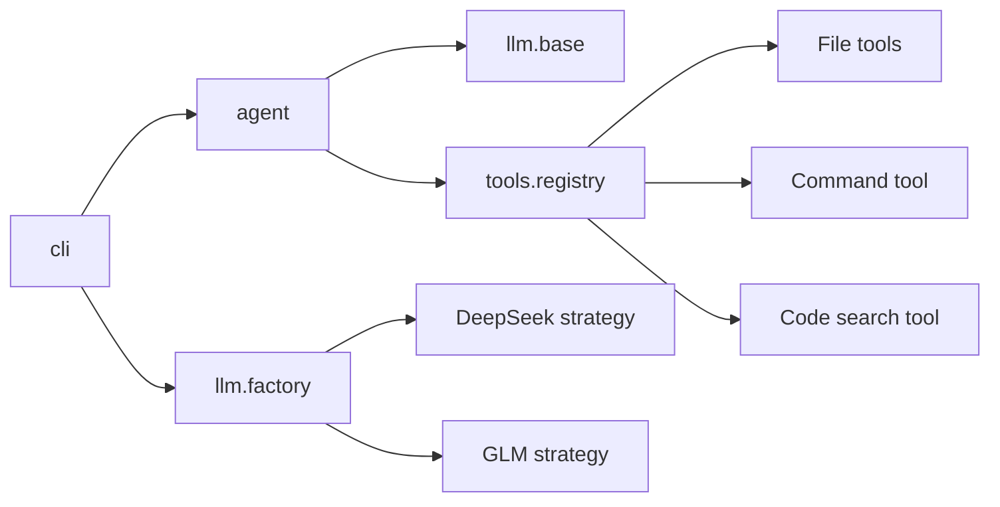

# ICoder 最小 ReAct Agent 实现计划

## 1. 目标与范围

参考 `paicli-main` 的分层结构，实现一个可在终端连续对话、调用本地工具并切换模型的 Python MVP。

本期只实现：

1. ReAct 工具调用循环。
2. 交互式 CLI，以及 `/model`、`/clear`、`/help`、`/exit` 命令。
3. 基于策略模式和工厂模式的 LLM 层，接入 OpenAI-compatible 的 DeepSeek V4 与 GLM。
4. 工具注册表，以及文件操作、命令执行、代码检索三类本地工具。
5. 单元测试和不依赖真实 API 的最小集成测试。

本期不实现流式 TUI、Memory、Plan-and-Execute、Multi-Agent、MCP、RAG、HITL、并行工具调用和配置持久化。这些能力不能进入 MVP 主链路，避免照搬 Java 项目后形成过度设计。

## 2. 关键设计决策

### 2.1 包目录

沿用仓库中已经存在的 `src/icoder/tools/`，不再新增名称冲突的 `tool/`。所有包目录补充 `__init__.py`。

计划结构：

```text
src/icoder/
├── __init__.py
├── __main__.py
├── agent/
│   ├── __init__.py
│   └── agent.py
├── cli/
│   ├── __init__.py
│   ├── commands.py
│   └── main.py
├── llm/
│   ├── __init__.py
│   ├── base.py
│   ├── openai_compatible.py
│   ├── deepseek.py
│   ├── glm.py
│   └── factory.py
└── tools/
	├── __init__.py
	├── base.py
	├── registry.py
	├── file_tools.py
	├── command_tool.py
	└── code_search_tool.py
```

### 2.2 依赖方向



`agent` 只依赖抽象的 `LlmClient` 和 `ToolRegistry`，不能直接判断 provider；模型差异全部留在 `llm` 层。CLI 负责组装对象和用户交互，不负责执行工具。

### 2.3 最小依赖

- `openai`：统一调用 OpenAI-compatible Chat Completions API。
- `python-dotenv`：开发环境读取 `.env`，真实密钥不得提交。
- `pytest`：测试。

建议增加 `pyproject.toml`，声明 `src` layout 和 `icoder` console script；`requirements.txt` 保留运行依赖，测试依赖可放在 optional dev dependencies。仓库当前的 `.evn` 疑似拼写错误，实施时统一为被 Git 忽略的 `.env`，并提供不含密钥的 `.env.example`。

## 3. 核心协议

### 3.1 LLM 抽象

`llm/base.py` 定义稳定的领域对象，避免 Agent 直接依赖 OpenAI SDK 返回类型：

- `ToolCall(id, name, arguments)`：`arguments` 保留 JSON 字符串，统一在工具层解析。
- `ChatResponse(content, tool_calls, reasoning_content=None)`。
- `LlmClient` 抽象方法：
  - `chat(messages, tools) -> ChatResponse`
  - `provider_name`、`model_name` 属性。

`messages` 使用 OpenAI Chat Completions 兼容字典。尤其要保留 assistant 的完整 `tool_calls` 和后续 tool 消息的 `tool_call_id`，否则第二次模型请求会违反协议。

### 3.2 Provider 策略与工厂

`OpenAICompatibleClient` 实现公共模板：

1. 创建 `OpenAI(api_key=..., base_url=...)`。
2. 调用 `chat.completions.create(...)`。
3. 将 SDK 响应归一化为 `ChatResponse`。
4. 统一处理超时、认证错误、空响应和工具调用参数。

具体策略只提供差异化配置：

| provider | API Key | 默认 Base URL | 默认模型 |
|---|---|---|---|
| `deepseek` | `DEEPSEEK_API_KEY` | `https://api.deepseek.com` | `deepseek-v4-flash`，允许 `DEEPSEEK_MODEL` 覆盖 |
| `glm` | `GLM_API_KEY` | `https://open.bigmodel.cn/api/coding/paas/v4` | `glm-5.1`，允许 `GLM_MODEL` 覆盖 |

默认模型名必须视为配置默认值，而不是写死的协议约束，以便供应商模型名变化时通过环境变量修正。

`LlmClientFactory.create(provider, model=None)` 完成 provider 归一化、配置读取和客户端创建。未知 provider、缺少 API Key、空模型均抛出明确的配置异常，禁止静默返回 `None`。

### 3.3 工具协议

`tools/base.py` 定义：

- `Tool(name, description, parameters, handler)`。
- `ToolResult(name, content, is_error=False)`。

`ToolRegistry` 提供：

- `register(tool)`：拒绝重复名称。
- `definitions()`：生成 OpenAI function tool schema。
- `execute(name, arguments_json)`：解析 JSON、查找工具、执行并返回字符串结果。

所有可预期错误都转换为可回灌给模型的工具结果，而不是终止 Agent，例如未知工具、非法 JSON、缺少参数、文件不存在、命令超时。

## 4. ReAct 主循环

`Agent.run(user_input)` 的唯一退出条件是模型返回不含工具调用的最终文本，或触发安全上限。

```text
初始化 history = [system]
追加 user 消息
最多循环 max_steps（默认 12）：
	response = llm.chat(history, registry.definitions())
	如果 response 有 tool_calls：
		追加包含 content + tool_calls 的 assistant 消息
		按返回顺序逐个执行工具
		每个结果追加 role=tool、tool_call_id、content
		continue
	否则：
		追加 assistant 消息
		返回最终文本
超过 max_steps：抛出 AgentLoopError
```

必须满足以下不变量：

1. 一次 `run()` 只追加一次原始 user 消息。
2. 每个 tool call 必须恰好对应一条相同 ID 的 tool result。
3. 工具报错也要作为 tool result 回灌，让模型有机会修正参数。
4. 对话历史跨 CLI 输入保留；`clear_history()` 只保留 system prompt。
5. `set_llm_client()` 切换模型时保留历史，但后续请求立即使用新客户端。
6. 空最终响应、连续重复工具调用和超过 `max_steps` 必须有明确失败信息，不能无限循环。

建议的最小 system prompt 只描述身份、工作目录、工具使用原则和“完成任务后直接回答”；不输出隐藏思维链，不要求模型把 Thought 文本显式打印出来。这里的 ReAct 指“模型选择工具 → 环境返回观察结果 → 模型继续决策”的协议循环。

## 5. CLI 设计

### 5.1 启动参数

使用 `argparse`：

- `--provider {deepseek,glm}`：覆盖默认 provider。
- `--model MODEL`：覆盖该次运行模型。
- `--workspace PATH`：工具允许访问的项目根，默认当前目录。
- `--max-steps N`：ReAct 最大迭代数。

启动入口统一为 `python -m icoder`，安装后可使用 `icoder`。

### 5.2 斜杠命令

`commands.py` 只做纯解析，返回结构化命令，便于无终端测试：

- `/model`：显示当前 provider/model 和可选 provider。
- `/model deepseek`、`/model glm`：通过工厂创建新客户端并调用 `agent.set_llm_client()`。
- `/model deepseek:<model>`：临时指定模型。
- `/clear`：清空会话历史。
- `/help`：显示命令。
- `/exit`、`/quit`：退出。

以 `/` 开头但无法识别的输入直接报未知命令，不能发送给模型。普通文本交给 `Agent.run()`。捕获 `EOFError`、`KeyboardInterrupt`、配置错误、LLM 错误并输出简洁信息，CLI 不打印堆栈。

## 6. 三类工具

### 6.1 文件操作 `file_tools.py`

MVP 注册：

- `read_file(path, offset?, limit?)`：UTF-8 文本读取，默认限制最大行数和返回字符数。
- `write_file(path, content)`：自动创建父目录，限制单次写入大小。
- `list_dir(path='.')`：目录优先、名称排序，限制结果数。

所有路径先经过 `workspace.resolve()`，并验证结果仍位于 workspace 内；拒绝 `..`、绝对路径和符号链接造成的根目录逃逸。

### 6.2 命令执行 `command_tool.py`

注册 `execute_command(command)`：

- `cwd` 固定为 workspace。
- 默认超时 60 秒。
- 合并或分别截断 stdout/stderr，返回退出码。
- Windows 使用当前系统 shell 的明确策略；不拼接用户工作目录。
- MVP 至少拦截明显的全盘破坏命令，但必须在文档说明：黑名单不等于沙箱，命令工具只应在可信工作区运行。

### 6.3 代码检索 `code_search_tool.py`

注册 `search_code(query, path='.', glob='*', regex=False, max_results=50)`：

- 递归扫描文本文件并返回相对路径、行号和匹配行。
- 忽略 `.git`、`venv`、`node_modules`、`dist`、`build`、二进制文件。
- 支持字面量和正则；正则编译失败作为工具错误返回。
- 限制文件大小、结果条数和总输出字符数。

MVP 优先使用 Python 标准库保证跨平台；后续再增加 `ripgrep` 加速策略，不在第一版同时维护两套搜索引擎。

## 7. 实施顺序

### 阶段 A：项目可安装

1. 添加 `pyproject.toml`、包初始化文件、依赖和 `.env.example`。
2. 验证 `python -m icoder --help`。

### 阶段 B：工具闭环

1. 实现工具领域对象和注册表。
2. 实现三类工具并注册到默认注册表。
3. 先完成路径逃逸、超时、截断等边界测试。

### 阶段 C：LLM 层

1. 实现抽象接口和 OpenAI-compatible 模板。
2. 实现 DeepSeek、GLM 瘦客户端和工厂。
3. 使用 mock SDK 响应验证普通文本、单工具、多工具和 API 异常归一化。

### 阶段 D：Agent

1. 实现历史管理和 ReAct 循环。
2. 使用 scripted fake LLM 测试“调用工具后得到最终回答”的完整协议。
3. 增加最大轮数、未知工具、非法参数和清空历史测试。

### 阶段 E：CLI

1. 实现纯命令解析和交互循环。
2. 接入模型切换与输出。
3. 完成无真实网络的 CLI 集成测试，再进行真实 provider 手工验证。

## 8. 测试计划

建议测试文件：

```text
tests/unit/agent/test_agent.py
tests/unit/cli/test_commands.py
tests/unit/llm/test_factory.py
tests/unit/llm/test_openai_compatible.py
tests/unit/tools/test_registry.py
tests/unit/tools/test_file_tools.py
tests/unit/tools/test_command_tool.py
tests/unit/tools/test_code_search_tool.py
tests/integration/test_react_flow.py
```

关键用例：

1. Fake LLM 第一次返回 `read_file`，第二次根据 tool result 返回答案。
2. assistant tool-call 消息与 tool result ID 一一对应。
3. 同一响应含多个工具调用时按顺序全部回灌。
4. 工具 JSON 非法时 Agent 不崩溃，模型下一轮能看到错误。
5. 模型持续调用工具时在 `max_steps` 停止。
6. `/model` 成功切换且保留历史；缺少 Key 时保持旧客户端。
7. 文件工具拒绝 workspace 外路径和符号链接逃逸。
8. 命令超时后子进程被终止，输出被截断。
9. 代码搜索忽略依赖目录并遵守结果上限。

测试不得调用真实模型 API。真实 API 只作为可选手工冒烟测试，并通过环境变量显式开启。

## 9. MVP 验收标准

同时满足以下条件才算完成：

1. 在全新虚拟环境中可安装并运行 `icoder`。
2. 配置任一 provider 后，普通问题能得到最终回答。
3. 模型能自主调用 `read_file`、`write_file`、`list_dir`、`execute_command`、`search_code`，工具结果能继续驱动下一轮模型调用。
4. `/model deepseek` 与 `/model glm` 能在同一会话中切换，失败切换不破坏当前客户端。
5. `/clear`、`/help`、未知命令、Ctrl+C、Ctrl+D 行为明确。
6. 不会读取或写入 workspace 外文件；命令有超时；所有大输出有上限。
7. 单元测试和集成测试全部通过，且测试过程无需 API Key、无需联网。

## 10. 后续演进顺序

MVP 稳定后再按收益依次增加：流式输出 → HITL 审批 → `ripgrep` 搜索后端 → 配置持久化 → token/context 预算 → 并行工具调用 → Memory/Plan/MCP。每次只扩展现有接口，不改变 ReAct 消息协议。